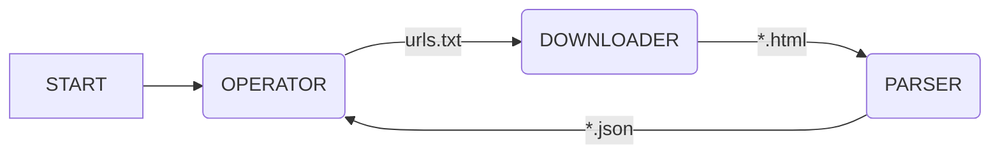

# Onigumo

## O projektu

Onigumo je jeden z dalších web-crawlerů, také známých pod pojmem _Spider_.
Onigumo obecně řídí toky dat, určuje směry toků a v jaké chvíli se
aktivuje příslušná operace.
Konrétně slouží k procházení webových aplikací či statických webových stránek.
Obsah a případně další příslušná metadata uloží do strukturované podoby,
která je vhodná pro další strojové zpracování. K dosažení tohoto cíle je
Onigumo rozděleno do tří vzájemně propojených logických celků
(Operator, Downloader, Parser), které tvoří procesní workflow.

## Arhitektura

Jádrem Oniguma jsou tři základní moduly:
* Operator
* Downloader
* Parser

jejichž vzájemná spolupráce je znázorněna na diagramu níže

### Operator
Hlavní úkoly operatoru jsou

1. inicializovat práci Oniguma na dané aplikaci na základě vstupních informací od
uživatele (jméno složky pro stahování informaci a první absolutní *url* adresa ke zpracování)
2. kontrolovat stav zpracovaných a nezpracovaných *url* adres
3. aktivovat downloader v případě existence nezpracovaných *url* adres

### Downloader

Činnost downloaderu je aktivována operatorem na základě informace o
nezpracovaných *url* adres. V případě aktivade downloader stáhne metadata
a obsah webové stránky, jejíž cestu jako vstupní informaci získal
od operatoru.

### Parser

Po ukončení stažení potřebných informací z dané *url* adresy se na
stažený obsah spustí parser, který uloží předem definové informace
z obsahu web stránky do strojově strukturované podoby dat. Strukturovaná
data jsou uloženy v sobourech na disku. Jména souborů jsou tvořeny jako
unikítní hashem, které jsou vytvořeny z jejich *url* adresy.

## Usage

## Credits

© Glutexo 2021
© Nappex 2021

Licenced under the MIT license
