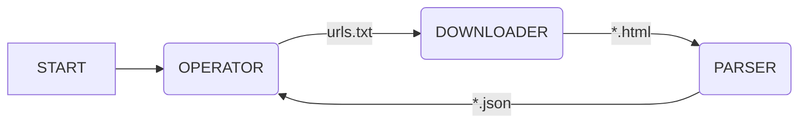

# Onigumo #

## About

Onigumo je jeden z dalších web-crawlerů, také známých pod pojmem _Spider_.
Onigumo obecně řídí toky dat, určuje směry toků a v jaké chvíli se aktivuje
příslušný modul.
Konrétně slouží k procházení webových aplikací či statických webových stránek.
Obsah a případně další příslušná metadata uloží do strukturované podoby,
která je vhodná pro další strojové zpracování. K dosažení tohoto cíle je
Onigumo rozděleno do tří vzájemně propojených logických celků
(Operator, Downloader, Parser), které tvoří procesní workflow.

## Architecture

Jádrem Oniguma jsou tři základní kameny:
* Operator
* Downloader
* Parser

jejichž vzájemná spolupráce je znázorněna na diagramu níže

### Operator
Hlavní úkoly operatoru jsou

1. inicializovat práci Oniguma na dané aplikaci na základě vstupních informací od
uživatele (jméno složky pro stahování informaci a první absolutní *url* adresa ke zpracování)
2. kontrolovat stav zpracovaných a nezpracovaných *url* adres
3. aktivovat downloader v případě existence nezpracovaných *url* adres

### Downloader

Činnost downloaderu je aktivována operatorem na základě informace o
nezpracovaných *url* adres. V případě aktivade downloader stáhne metadata
a obsah webové stránky, jejíž cestu jako vstupní informaci získal
od operatoru.

### Parser

Po ukončení stažení potřebných informací z dané *url* adresy se na
stažený obsah spustí parser, který uloží předem definové informace
z obsahu web stránky do strojově strukturované podoby dat. Strukturovaná
data jsou uloženy v sobourech na disku. Jména souborů jsou tvořeny jako
unikítní hashem, které jsou vytvořeny z jejich *url* adresy.

## About ##

This is an attempt to build just another web-crawler, also called _Spider_. Its purpose is to get data from a website in a form of a list of objects. This data can be then used to download linked files and place them in a database or a folder structure.

## Architecture ##

### Building blocks ###

The application uses Spiders (Ruby modules) containing workflow and data-mining methods to get data from a website. A Spider’s public interface consists of workflows how to get all the wanted data from the server. Typically get a page, parse it and possibly get more pages using the parsed data.

### Mechanism ###

Scraping starts by inserting the first workflow action on a queue. This action doesn’t take any input an thus doesn’t have to wait for any data to be parsed. Any action can queue another action that uses the data parsed from a download page. Downloading and parsing ends when there is no more actions to be launched.

## Usage ##

## Credits ##

© Glutexo 2019

Licenced under the MIT license
