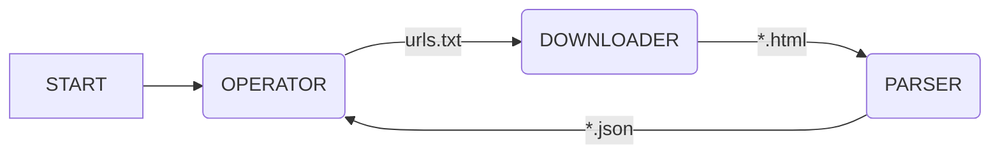

# Onigumo

## O projektu

Onigumo je jeden z dalších web-crawlerů, také známých pod pojmem _Spider_.
Onigumo obecně řídí toky dat, určuje směry toků a v jaké chvíli se
aktivuje příslušná operace.
Konrétně slouží k procházení webových aplikací či statických webových stránek.
Obsah a případně další příslušná metadata uloží do strukturované podoby,
která je vhodná pro další strojové zpracování. K dosažení tohoto cíle je
Onigumo rozděleno do tří vzájemně propojených logických celků
(Operator, Downloader, Parser), které tvoří procesní workflow.

## Arhitektura

Jádrem Oniguma jsou tři základní moduly:
* Operator
* Downloader
* Parser

jejichž vzájemná spolupráce je znázorněna na diagramu níže

### Operator
Operator vytváří frontu url adres pro `Donwloader`. Tato fronta je vytvořena
z počáteční uživatelské konfigurace a zároveň z výstupních dat modulu `Parser`

Činnost `Operatoru` se skládá:
1. inicializovat práci Oniguma na dané aplikaci na základě uživatelské
konfigurace
2. kontrolovat stav zpracovaných a nezpracovaných *url* adres z výstupu
`Operatoru`, popř. dle zapsaných souborů
3. načítat nezpracované *url* adresy ze strukturovaných dat stažené stránky
4. zařazovat nezpracované *url* adresy do fronty pro `Downloader`
5. mazat *url* adresu z fronty od `Parseru` po předání všech nových stránek
v jejím obsahu do fronty pro `Downloader`

### Downloader
Downloader stahuje obsah a metadata nezpracovaných *url* adres.

Činnost `Downloader` se skládá:

1. kontrolovat stav fronty s *url* adresami ke stažení
2. stahovat obsah *url* adres a případná metadata
4. vytváří frontu stažených *url* adres včetně jejich obsahu a metadat
3. mazat zpracované *url* adresy z fronty

### Parser
Parsuje potřebná data ze staženého obsahu a metadat do strukturované podoby.

Činnost `Parseru` se skládá:

1. kontrolovat stav fronty se staženými *url* adresami
2. parsovat obsah a metadata stažených *url* adres do strukturované podoby dat
3. strukturovaná data ukládat do json souborů, jejichž jména jsou tvořena
hashem z jejich *url* adres
4. aktivace pluginu (pavouků) na strukturovaná data
5. mazat *url* adresy z fronty stažených *url* adres

## Usage

## Credits

© Glutexo 2021
© Nappex 2021

Licenced under the MIT license
