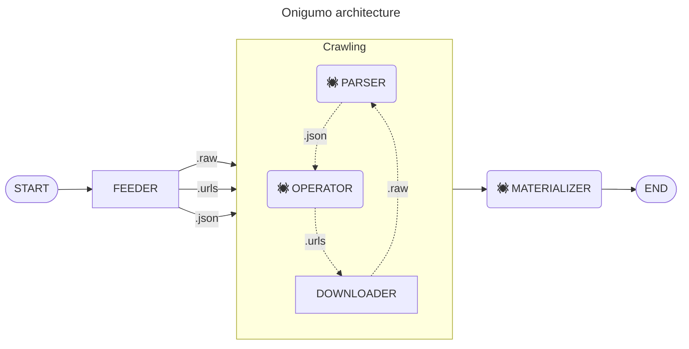

# Onigumo #

## About ##

Onigumo is yet another web-crawler. It “crawls” websites or webapps, storing their data in a structured form suitable for further machine processing.

## Architecture ##

Onigumo is composed of three sequentially interconnected components:

* [the Operator](#operator),
* [the Downloader](#downloader),
* [the Parser](#parser).

The flowchart below illustrates the flow of data between those parts:

### Operator ###

The Operator determines URL addresses for the Downloader. A Spider is responsible for adding the URLs, which it gets from the structured form of the data provided by the Parser.

The Operator’s job is to:

1. initialize a Spider,
2. extract new URLs from structured data,
3. insert those URLs onto the Downloader queue.

### Downloader ###

The Downloader fetches and saves the contents and metadata from the unprocessed URL addresses.

The Downloader’s job is to:

1. read URLs for download,
2. check for the already downloaded URLs,
3. fetch the URLs contents along with its metadata,
4. save the downloaded data.

### Parser ###

Zpracovává data ze staženého obsahu a metadat do strukturované podoby.

Činnost _parseru_ se skládá z:

1. kontroly stažených URL adres ke zpracování,
2. zpracovávání obsahu a metadat stažených URL do strukturované podoby,
3. ukládání strukturovaných dat.

## Aplikace (pavouci) ##

Ze strukturované podoby dat vytáhne potřebné informace.

Podstata výstupních dat či informací je závislá na uživatelských potřebách a také podobě internetového obsahu. Je nemožné vytvořit univerzálního pavouka splňujícího všechny požadavky z kombinace obou výše zmíněných. Z tohoto důvodu je nutné si napsat vlastního pavouka.

### Materializer ###

## Usage ##

## Credits ##

© [Glutexo](https://github.com/Glutexo), [nappex](https://github.com/nappex) 2019 – 2022

Licenced under the [MIT license](LICENSE.txt).
