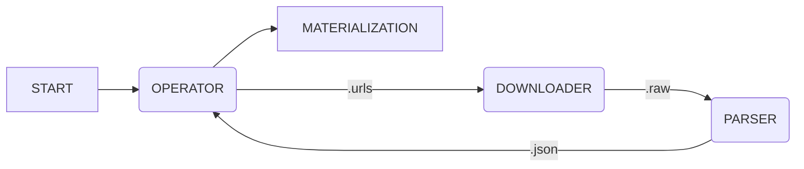

# Onigumo #

## About ##

Onigumo is yet another web-crawler. It “crawls” websites or webapps, storing their data in a structured form suitable for further machine processing.

## Architecture ##

Onigumo is composed of three sequentially interconnected components:

* the Operator,
* the Downloader,
* the Parser.

The flowchart below illustrates the cooperation of those parts:

### Operator ###

Determines URL addresses for download for the Downloader. A Spider is responsible for adding the URLs. The Spider gets the new URLs from the parsed form of the data, which the Parser creates.

The Operator’s job is composed of:

1. initialization of a Spider,
2. check for the existence of a new URL list,
3. extraction of new URLs from structured data,
4. insertion of those URLs to the Downloader queue.

### Downloader ###

Stahuje obsah a metadata nezpracovaných URL adres.

Činnost _downloaderu_ se skládá z:

1. načítání URL ke stažení,
2. kontroly stažených URL,
3. stahování obsahu URL a případných metadat,
4. uložení stažených dat.

### Parser ###

Zpracovává data ze staženého obsahu a metadat do strukturované podoby.

Činnost _parseru_ se skládá z:

1. kontroly stažených URL adres ke zpracování,
2. zpracovávání obsahu a metadat stažených URL do strukturované podoby,
3. ukládání strukturovaných dat.

## Aplikace (pavouci) ##

Ze strukturované podoby dat vytáhne potřebné informace.

Podstata výstupních dat či informací je závislá na uživatelských potřebách a také podobě internetového obsahu. Je nemožné vytvořit univerzálního pavouka splňujícího všechny požadavky z kombinace obou výše zmíněných. Z tohoto důvodu je nutné si napsat vlastního pavouka.

### Materializer ###

## Usage ##

## Credits ##

© [Glutexo](https://github.com/Glutexo), [nappex](https://github.com/nappex) 2019 – 2022

Licenced under the MIT license
