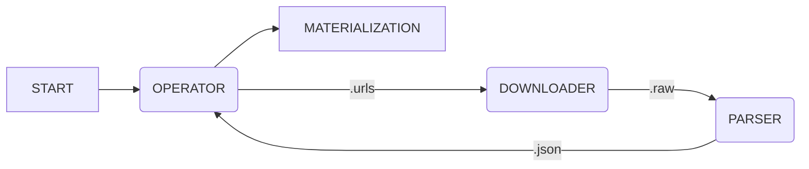

# Onigumo #

## About ##

Onigumo je web-crawler.

Onigumo „prolézá“ webové stránky či aplikace. Jejich obsah a případná metadata uloží do strukturované podoby, která je vhodná pro další strojové zpracování.

## Architecture ##

Onigumo je rozděleno do tří na sebe vzájemně navazujících částí:

* operator - řízení,
* downloader - stahování,
* parser - zpracování.

Diagram níže znázorňuje vzájemnou součinnost těchto celků:

### Operator ###

Určuje adresy ke stažení pro _downloader_. Za přidávání adres ke zpracování je zodpovědný pavouk. Nové adresy pavouk získává z naparsované podoby dat, kterou vytváří _parser_.

Činnost _operatoru_ se skládá z:

1. inicializace pavouka,
2. kontroly existence seznamu nových adres,
3. načítání nových adres ze strukturovaných dat,
4. zařazování těchto adres do fronty pro _downloader_.

### Downloader ###

Stahuje obsah a metadata nezpracovaných adres.

Činnost _downloaderu_ se skládá z:

1. načítání adres ke stažení,
2. kontroly stažených adres,
3. stahování obsahu adres a případných metadat,
4. uložení stažených dat.

### Parser ###

Zpracovává data ze staženého obsahu a metadat do strukturované podoby.

Činnost _parseru_ se skládá z:

1. kontroly stažených adres ke zpracování,
2. zpracovávání obsahu a metadat stažených adres do strukturované podoby,
3. ukládání strukturovaných dat.

## Aplikace (pavouci) ##

Ze strukturované podoby dat vytáhne potřebné informace.

Podstata výstupních dat či informací je závislá na uživatelských potřebách a také podobě internetového obsahu. Je nemožné vytvořit univerzálního pavouka splňujícího všechny požadavky z kombinace obou výše zmíněných. Z tohoto důvodu je nutné si napsat vlastního pavouka.

### Materializer ###

## Usage ##

## Credits ##

© Glutexo 2019

Licenced under the MIT license
