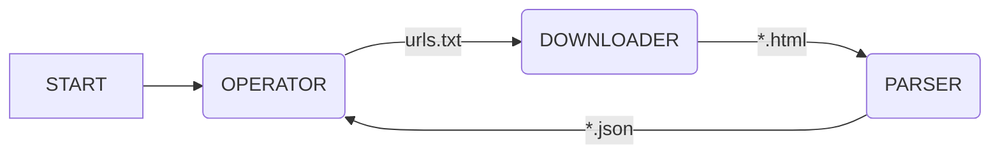

# Onigumo #

## About ##

Onigumo je jeden z dalších web-crawlerů, také známých pod pojmem _Spider_.
Onigumo obecně řídí toky dat, určuje směry toků a v jaké chvíli se
aktivuje příslušná operace.
Onigumo prochází webové stránky či aplikace. Jejich obsah a případně další příslušná metadata uloží do strukturované podoby, která je vhodná pro další strojové zpracování. K dosažení tohoto cíle je Onigumo rozděleno do tří vzájemně propojených logických celků: jeden pro řízení (operator), další pro stahování (downloader) a poslední pro zpracovávání (parser).

## Architecture ##

Onigumo tvoří tři základní části:
* Operator
* Downloader
* Parser

jejichž vzájemná spolupráce je znázorněna na diagramu níže

### Operator ###
Operator vytváří frontu url adres pro `Downloader`. Tato fronta je vytvořena
z počáteční uživatelské konfigurace a zároveň z výstupních dat modulu `Parser`

Činnost `Operatoru` se skládá z:
1. inicializace práce Oniguma na dané aplikaci na základě uživatelské
konfigurace
2. kontroly stavu zpracovaných a nezpracovaných URL adres z výstupu
`Operatoru`, popř. dle zapsaných souborů
3. načítání nezpracovaných URL adres ze strukturovaných dat stažené stránky
4. zařazování nezpracovaných URL adres do fronty pro `Downloader`
5. mazání URL adres z fronty od `Parseru` po předání všech nových stránek
v jejím obsahu do fronty pro `Downloader`

### Downloader ###
Downloader stahuje obsah a metadata nezpracovaných URL adres.

Činnost `Downloader` se skládá:

1. načítat URL adresy ke stažení z fronty
2. stahování obsahu URL adres a případných metadat
4. vytváření fronty stažených URL adres včetně jejich obsahu a metadat
3. mazání zpracovaných URL adres z fronty

### Parser ###
Parsuje potřebná data ze staženého obsahu a metadat do strukturované podoby.

Činnost `Parseru` se skládá:

1. kontrolovat stav fronty se staženými URL adresami
2. parsovat obsah a metadata stažených URL adres do strukturované podoby dat
3. strukturovaná data ukládat do json souborů, jejichž jména jsou tvořena
hashem z jejich URL adres
4. aktivace pluginu (pavouků) na strukturovaná data
5. mazat URL adresy z fronty stažených URL adres

#### Pluginy (Pavouci - spiders)
Ze strukturované podoby dat uložené v json souborech, vyscrapuje potřebné
informace.

Charakter výstupních dat či informací je závislý na uživatelských
potřebách a také podoby internetového obsahu.
Je téměř nemožné vytvořit univerzálního pavouka splňujícího
všechny požadavky z kombinace obou výše zmíněných.
Proto je možné si nadefinovat vlastní plugin pro vlastní potřeby
s následujícím API:

- blabla
- blabla

## Usage ##

## Credits ##

© Glutexo 2019

Licenced under the MIT license
